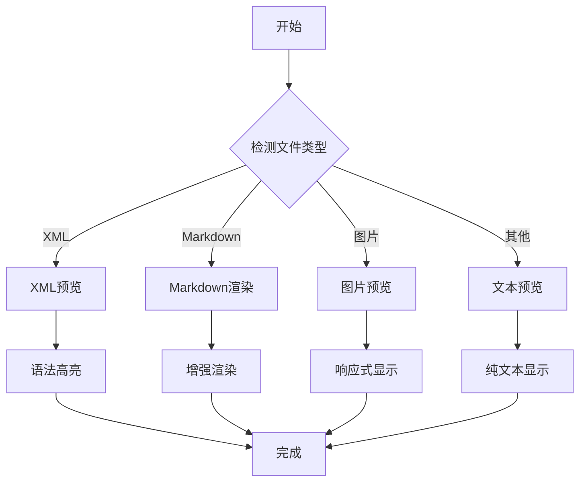
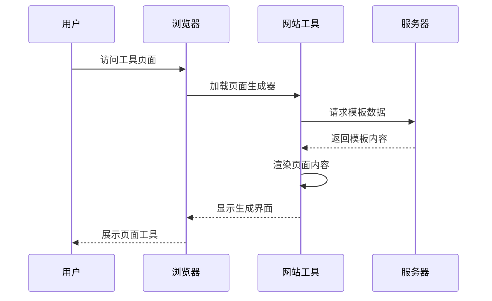
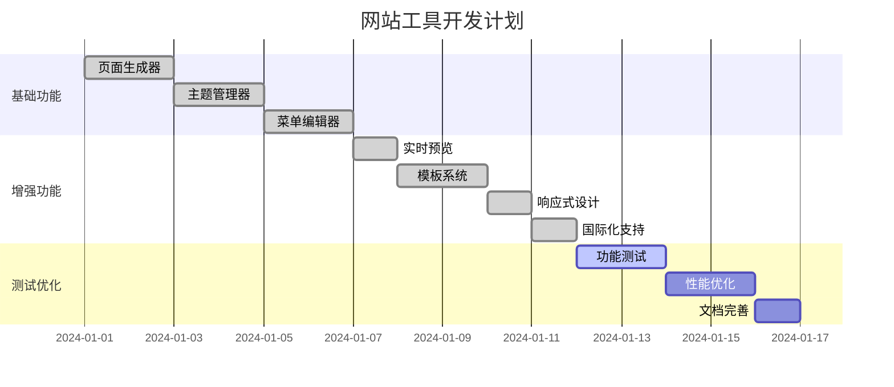

# Markdown语法测试文档

这是一个用于测试Markdown渲染功能的文档，包含了各种Markdown语法和增强功能。

## 基本语法测试

### 文本格式

这是**粗体文本**，这是*斜体文本*，这是***粗斜体文本***。

这是~~删除线文本~~，这是`行内代码`。

### 列表

#### 无序列表
- 项目1
- 项目2
  - 子项目2.1
  - 子项目2.2
- 项目3

#### 有序列表
1. 第一项
2. 第二项
   1. 子项目2.1
   2. 子项目2.2
3. 第三项

### 链接和图片

[Uncle1bo Static Website](https://github.com/uncle1bo)

### 引用

> 这是一个引用块。
> 
> 可以包含多行内容。
> 
> > 这是嵌套引用。

### 表格

| 功能 | 状态 | 描述 |
|------|------|------|
| 页面生成器 | ✅ | 支持多种页面模板 |
| 主题管理器 | ✅ | 支持主题切换和定制 |
| 菜单编辑器 | ✅ | 可视化菜单编辑 |
| 实时预览 | ✅ | 基于Bootstrap |
| 响应式设计 | ✅ | 移动端适配 |

## 代码块测试

### JavaScript代码

```javascript
// 网站工具示例代码
class WebsiteManager {
    constructor() {
        this.tools = {
            'pageGenerator': { name: '页面生成器', icon: 'bi-file-plus' },
            'themeManager': { name: '主题管理器', icon: 'bi-palette' }
        };
    }
    
    async generatePage(pageInfo) {
        try {
            const template = await this.loadTemplate(pageInfo.template);
            return this.renderPage(template, pageInfo.data);
        } catch (error) {
            console.error('页面生成失败:', error);
        }
    }
}
```

### Python代码

```python
# Python示例代码
def fibonacci(n):
    """计算斐波那契数列"""
    if n <= 1:
        return n
    return fibonacci(n-1) + fibonacci(n-2)

# 生成前10个斐波那契数
for i in range(10):
    print(f"F({i}) = {fibonacci(i)}")
```

### CSS代码

```css
/* 响应式设计样式 */
.website-container {
    max-width: 100%;
    margin: 0 auto;
    padding: 1rem;
    border-radius: 8px;
    box-shadow: 0 4px 6px rgba(0, 0, 0, 0.1);
}

@media (max-width: 768px) {
    .website-container {
        padding: 0.5rem;
        margin: 0.5rem;
    }
}
```

## 数学公式测试

### 行内公式

这是一个行内公式：$E = mc^2$，这是另一个：$\sum_{i=1}^{n} x_i$。

### 块级公式

$$
\int_{-\infty}^{\infty} e^{-x^2} dx = \sqrt{\pi}
$$

$$
\begin{pmatrix}
a & b \\
c & d
\end{pmatrix}
\begin{pmatrix}
x \\
y
\end{pmatrix}
=
\begin{pmatrix}
ax + by \\
cx + dy
\end{pmatrix}
$$

## Mermaid图表测试

### 流程图



### 时序图



### 甘特图



## 特殊功能测试

### 任务列表

- [x] 实现页面生成器
- [x] 实现主题管理器
- [x] 添加菜单编辑器
- [x] 支持实时预览
- [x] 支持模板系统
- [x] 添加响应式设计
- [ ] 添加更多模板
- [ ] 支持更多主题

### 脚注

这是一个带脚注的文本[^1]。

[^1]: 这是脚注内容。

### 高亮文本

==这是高亮文本==（如果支持的话）。

## 总结

这个静态网站工具集支持多种网站管理功能，包括：

1. **页面管理**：页面生成器、模板系统、内容编辑等
2. **主题管理**：主题切换、颜色配置、样式定制等
3. **菜单管理**：导航编辑、链接管理、结构调整等

主要特性：
- 🎨 现代化界面设计
- 📝 实时预览功能
- 🧮 响应式布局
- 📊 可视化编辑
- 📋 一键生成代码
- 📱 移动端适配
- 🚀 纯静态实现，无服务器依赖

完全符合Cloudflare Pages的静态网站要求！